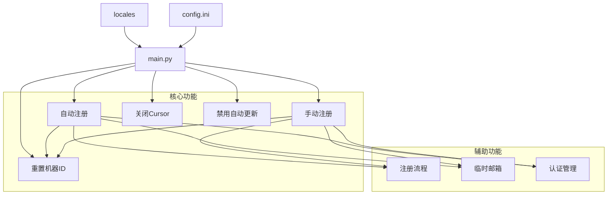

好的，我需要整理这个项目的架构，说明项目是做什么的，整理文档结构和项目架构图，生成readme-cn并生成mermaid图。这个任务很重要，我需要认真完成。

首先，让我理解这个项目是做什么的。从提供的代码片段和文件来看，这似乎是一个名为"Cursor Free VIP"的工具，用于自动注册Cursor（一个编程工具/IDE）的会员资格，并支持Windows和macOS系统。

从README.md文件中，我可以看到这个项目的主要功能：
1. 自动注册Cursor会员
2. 支持Windows和macOS系统
3. 完成Auth验证
4. 重置Cursor的配置

项目的主要组件似乎包括：
1. 主程序(main.py)
2. 重置机器ID的功能(reset_machine_manual.py)
3. 注册新账号的功能(cursor_register.py, new_signup.py)
4. 认证管理(cursor_auth.py)
5. 临时邮箱生成(new_tempemail.py)
6. 关闭Cursor应用程序的功能(quit_cursor.py)
7. 禁用自动更新的功能(disable_auto_update.py)
8. 多语言支持(locales目录下的json文件)

项目的构建使用了PyInstaller，通过GitHub Actions自动构建Windows和其他平台的可执行文件。

现在，我将整理这些信息，创建一个项目架构图，并生成一个中文版的README文件。

对于架构图，我可以使用Mermaid来创建，显示主要组件之间的关系。


# Cursor Free VIP
<div align="center">
<p align="center">

</p>
<p align="center">


</p>
<h4>支持最新0.47.x版本</h4>

这是一个自动化工具，自动注册，支持Windows和macOS系统，完成Auth验证，重置Cursor的配置。


  <br>

[Chrome]
# 默认Google Chrome 浏览器路径
chromepath = C:\Program Files\Google/Chrome/Application/chrome.exe

[Turnstile]
# 等待人机验证时间
handle_turnstile_time = 2
# 等待人机验证随机时间（必须是 1-3 或者 1,3 这样的组合）
handle_turnstile_random_time = 1-3

[OSPaths]
# 存储路径
storage_path = /Users/username/Library/Application Support/Cursor/User/globalStorage/storage.json
# SQLite路径
sqlite_path = /Users/username/Library/Application Support/Cursor/User/globalStorage/state.vscdb
# 机器ID路径
machine_id_path = /Users/username/Library/Application Support/Cursor/machineId

[Timing]
# 最小随机时间
min_random_time = 0.1
# 最大随机时间
max_random_time = 0.8
# 页面加载等待时间
page_load_wait = 0.1-0.8
# 输入等待时间
input_wait = 0.3-0.8
# 提交等待时间
submit_wait = 0.5-1.5
# 验证码输入等待时间
verification_code_input = 0.1-0.3
# 验证成功等待时间
verification_success_wait = 2-3
# 验证重试等待时间
verification_retry_wait = 2-3
# 邮件检查初始等待时间
email_check_initial_wait = 4-6
# 邮件刷新等待时间
email_refresh_wait = 2-4
# 设置页面加载等待时间
settings_page_load_wait = 1-2
# 失败重试时间
failed_retry_time = 0.5-1
# 重试间隔
retry_interval = 8-12
# 最大超时时间
max_timeout = 160




本项目主要使用Python实现，通过以下技术完成功能：
自动化浏览器操作：使用DrissionPage库控制Chrome浏览器，完成注册、验证等操作
系统操作：修改系统文件和注册表，重置机器ID
数据库操作：修改SQLite数据库，更新Cursor的认证信息
多语言支持：通过JSON文件实现多语言界面
配置管理：使用INI文件存储和管理配置信息

```mermaid
cursor-free-vip/
├── main.py                  # 主程序入口
├── reset_machine_manual.py  # 重置机器ID功能
├── cursor_register.py       # 自动注册功能
├── cursor_register_manual.py # 手动注册功能
├── cursor_auth.py           # 认证管理
├── new_signup.py            # 注册流程实现
├── new_tempemail.py         # 临时邮箱生成
├── quit_cursor.py           # 关闭Cursor应用
├── disable_auto_update.py   # 禁用自动更新
├── build.spec               # PyInstaller构建配置
├── locales/                 # 多语言支持
│   ├── en.json              # 英文
│   ├── zh_cn.json           # 简体中文
│   └── zh_tw.json           # 繁体中文
├── scripts/                 # 安装脚本
│   ├── install.sh           # Linux/macOS安装脚本
│   ├── install.ps1          # Windows安装脚本
│   ├── reset.sh             # Linux/macOS重置脚本
│   └── reset.ps1            # Windows重置脚本
├── images/                  # 图片资源
└── .github/                 # GitHub配置
    └── workflows/           # GitHub Actions工作流
        └── build.yml        # 自动构建配置
```

